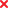
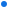
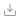

## SupDAM 自定义 icon 组件库

### SupDAMIcon 属性说明

| 参数      | 说明           | 类型                | 默认值  | 是否必选 | 可选参数 |
| --------- | -------------- | ------------------- | ------- | -------- | -------- |
| type      | icon 类型标识  | string              | 无      | 是       | 无       |
| primary   | 高亮显示       | boolean             | false   | 非       | 无       |
| disabled  | 不可用状态     | boolean             | false   | 非       | 无       |
| width     | 图标宽度       | string              | string  | 非       | 无       |
| height    | 图标高度       | string              | false   | 非       | 无       |
| fill      | svg 填充色     | string              | #969CA6 | 非       | 无       |
| className | svg class 样式 | string              | false   | 非       | 无       |
| style     | svg style 样式 | React.CSSProperties | 无      | 是       | 无       |

- tips: 当含有 width 和 height 时,图标大小以最小值显示

### 使用方式

```
import Icon from '@component/Icon';

ReactDOM.render(
  <div className="supngin-wrapper">
    <Icon type='add' color='red' className='supngin-icon' />
    <Icon type='delete' primary style={{ fontSize: '32px' }} />
  </div>,
  mountNode,
);
```

### 图标类型示例

| type             | 显示                                                 |
| ---------------- | ---------------------------------------------------- |
| home             |                  |
| map              |                   |
| add              |                   |
| remove           |                |
| search           |                |
| ellipsis         |              |
| success          |               |
| error            |                 |
| close            |                 |
| save             |                  |
| arrow            |              |
| arrow-down       |         |
| circle-success   |        |
| circle-error     |          |
| circle-info      |           |
| circle-help      |           |
| link-off         |            |
| circle-close     |          |
| mouse            |                 |
| filter           |                |
| move-top         |              |
| move-bottom      |           |
| move-up          |               |
| move-down        |             |
| modeling         |              |
| viewing          |               |
| zoom-out         |              |
| zoom-in          |               |
| pan              |                   |
| publish          |               |
| folder-open      |    |
| folder-close     |   |
| file             |                  |
| setting          |               |
| label-hidden     |      |
| label-show       |           |
| date             |                  |
| time             |                  |
| up               |                    |
| down             |                  |
| keyboard         |              |
| upload           |                |
| dot              |                     |
| edit             |                  |
| 菜单             | -------------                                        |
| collapsed-open   |    |
| collapsed-close  |   |
| data-integration |  |
| data-process     |      |
| data-quality     |      |
| data-security    |     |
| data-service     |      |
| factory          |               |
| 脚本编辑器       | --------------                                       |
| undo             |                  |
| redo             |                  |
| comment          |               |
| uncomment        |         |
| align-left       |          |
| align-right      |         |
| import           |                |
| export           |                |
| download         |              |
